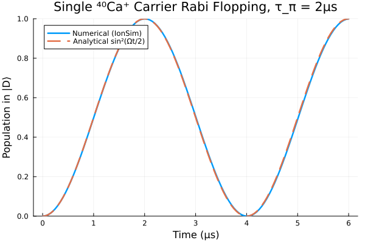
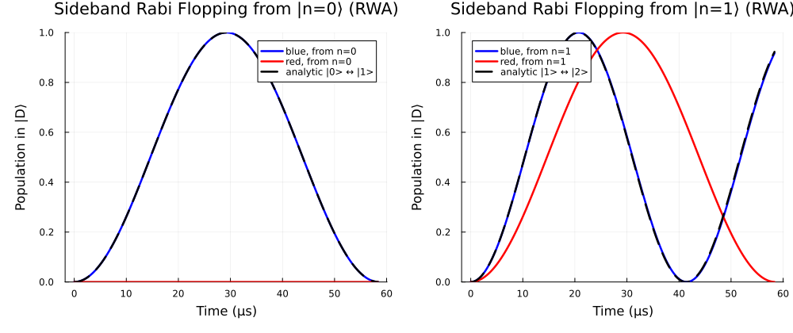
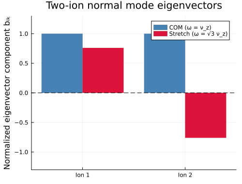
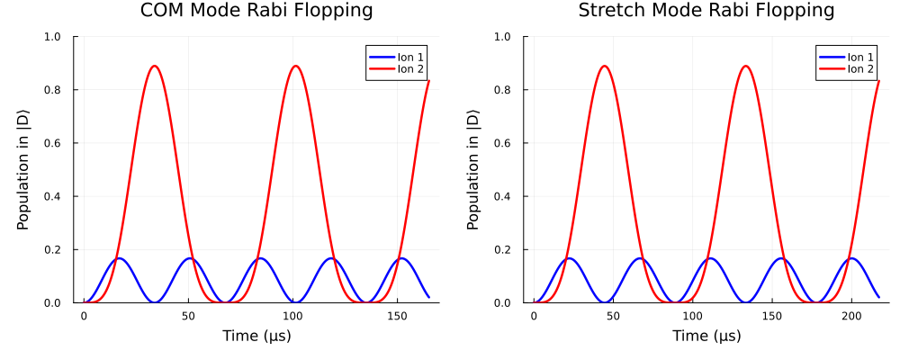
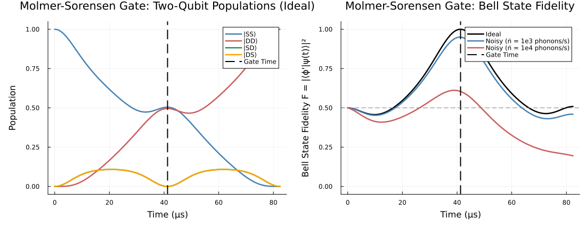
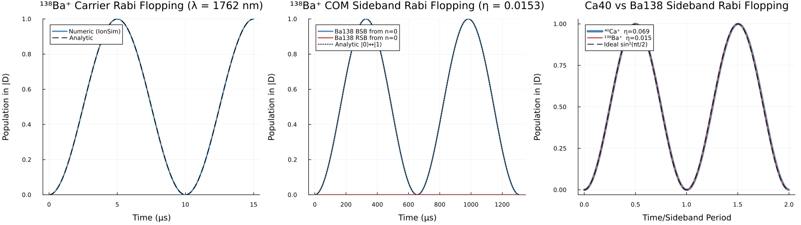

# Trapped-Ion Quantum Simulation in Julia

*Learning Julia through trapped-ion physics — from single-ion Rabi flopping to a
Mølmer–Sørensen entangling gate, plus an open-source contribution to
[IonSim.jl](https://github.com/HaeffnerLab/IonSim.jl).*


**Open-source contribution:** Added ¹³⁸Ba⁺ species support to IonSim.jl —
[PR #121](https://github.com/HaeffnerLab/IonSim.jl/pull/121), addressing
[issue #74](https://github.com/HaeffnerLab/IonSim.jl/issues/74) (under review).

**Stack:** Julia 1.11 · IonSim.jl (dev) · QuantumOptics.jl · Plots.jl

---

## Project overview

Five steps, each building on the last, each validated against an analytic
prediction before moving on:

| Step | Simulation | Key validation |
|------|-----------|----------------|
| 1 | Single-ion (⁴⁰Ca⁺) carrier Rabi flopping | Numerics match sin²(Ωt/2); residual 0.01 deviation traced to Lamb-Dicke coupling |
| 2 | Motional sideband driving | η = 0.0685; sideband Ω matches Ω·η·e^(−η²/2)·√n; AC Stark artifact diagnosed & removed |
| 3 | Two-ion normal mode analysis | ω_stretch/ω_COM = 1.7321 (analytic √3); eigenvectors [1,1]/√2 and [1,−1]/√2 confirmed |
| 4 | Mølmer–Sørensen entangling gate + noise | Bell fidelity = 1.0 (ideal); heating-rate degradation matches F ≈ 1 − n̄ estimate |
| 5 | ¹³⁸Ba⁺ species contribution + validation | 1762.17 nm qubit λ, τ(D5/2) = 32.3 s, Zeeman shifts confirm measured g-factors |

---

## Step 1 — Carrier Rabi flopping (⁴⁰Ca⁺)

A single Ca⁺ ion in a linear Paul trap (ω_z = 1 MHz), one laser resonant with
the 4S₁/₂ ↔ 3D₅/₂ quadrupole transition at 729 nm, π-time 2 μs.

The numerical population oscillation sits on the analytic sin²(Ωt/2) curve
with a maximum deviation of 0.010. That residual isn't solver error: with the
default `lamb_dicke_order=1` the Hamiltonian retains a weak off-resonant
coupling to the (ground-state) vibrational mode that the ideal two-level
formula omits. Setting `lamb_dicke_order=0` collapses the deviation — a first
example of using the model/theory mismatch itself as a diagnostic.



## Step 2 — Sideband driving and the Lamb-Dicke regime

Detuning the laser by ±ν selects the blue/red motional sideband. Measured
η = 0.0685, matching the analytic k_z·√(ħ/2mω) for the 45° beam geometry.

Two textbook results reproduced directly:
- **Selection rule:** red sideband from |n=0⟩ stays dark (no phonon to remove).
- **√n scaling:** the 1→2 blue-sideband rate exceeds the 1→0 red rate by √2.

**Debugging story worth telling:** initial sideband contrast capped at ~0.27
instead of reaching 1. Diagnosis: the off-resonant carrier (Ω/2π ≈ 250 kHz,
only 1 MHz away) imposes an AC Stark shift comparable to the sideband Rabi
frequency (~17 kHz), turning the resonant flop into a reduced-contrast detuned
one. Fix: `rwa_cutoff = 1e5` drops couplings rotating faster than 100 kHz —
chosen to sit in the gap between the sideband rate and the carrier offset that
the Lamb-Dicke regime guarantees. Full contrast restored.

A second bug — both "blue" and "red" Hamiltonians silently identical — taught
the key IonSim/Julia pattern: `hamiltonian()` **bakes in** parameter values at
call time (no live references, unlike Python objects), so `detuning!()` must
immediately precede every `hamiltonian()` call.



## Step 3 — Two-ion normal modes

Two Ca⁺ ions share motion through Coulomb coupling, splitting the axial motion
into COM and stretch modes.

Validated against theory:
- ω_stretch/ω_COM = **1.732051** (analytic √3; COM at exactly ω_z by Kohn's theorem)
- η ratios: ion1/ion2 = 1.0000 (COM), ion1/(−ion2) = 1.0000 (stretch) —
  confirming eigenvectors [1,1]/√2 and [1,−1]/√2
- Stretch/COM η scaling 0.7598 = √(ω_z/ω_stretch), the zero-point-amplitude factor

The opposite-sign stretch coupling of ion 2 is the mechanical ingredient the
MS gate exploits in Step 4.




## Step 4 — Mølmer–Sørensen entangling gate

Bichromatic drive: two laser tones detuned δ above the blue and below the red
COM sidebands drive a state-dependent force whose phase-space loop closes at
t_gate = 2π/δ, imprinting a geometric phase. Gate condition δ = 2ηΩ gives
φ = π/4 (maximally entangling), t_gate = 41.3 μs.

Ideal result at t_gate: P(SS) = 0.504, P(DD) = 0.496, P(SD) = P(DS) = 0.000,
**Bell fidelity |⟨Φ⁺|ψ⟩|² = 1.000** for |Φ⁺⟩ = (|SS⟩ + i|DD⟩)/√2.

Noise model: Lindblad master equation with motional heating jump operator
L = √Γ·â†_COM. Peak fidelities ≈ 0.95 (10³ phonons/s) and ≈ 0.60 (10⁴ phonons/s),
quantitatively matching the F ≈ 1 − n̄_added estimate (n̄ = ṅ·t_gate = 0.04 and
0.41 respectively).

Readout subtlety: joint two-qubit populations via products of single-ion
projectors silently returned wrong values; the correct approach is `ptrace`
over the motional modes and reading the reduced density-matrix diagonal.



## Step 5 — Contributing ¹³⁸Ba⁺ to IonSim.jl

IonSim shipped Be⁹, Ca⁴⁰, Mg²⁵, Yb¹⁷¹ — barium was an open feature request
(issue #74). I implemented `Ba138` following the existing species pattern:

- Energy levels from the NIST Atomic Spectra Database (Ba II)
- E1 Einstein A coefficients per Iskrenova-Tchoukova & Safronova,
  PRA 78, 012508 (2008); E2 rates from measured D-state lifetimes
- g(5D₅/₂) = 1.200371 from Hoffman et al., PRA 88, 025401 (2013)
- Zero nuclear spin (I = 0) → f = j throughout

Validation (all independent of the input data-entry path):
- Qubit transition: **1762.17 nm** (expected ≈ 1762 nm)
- `lifetime(ba, "D5/2")` = **32.3 s** — computed by IonSim from the A
  coefficient, matching the measured ~32 s
- Zeeman shifts at 0.1 mT: −1.401 MHz (S1/2), −0.840 MHz (D5/2) — confirming
  the measured g-factors are read from the species file, not Landé fallbacks
- Mixed Ba¹³⁸/Ca⁴⁰ chains construct and solve correctly
- All 233 existing IonSim tests pass unchanged

Then the full-circle simulation: Steps 1–2 re-run with Ba¹³⁸. With the 45°
beam geometry, η_Ba = **0.0153** vs η_Ca = 0.0685 — suppressed by both the
2.4× longer qubit wavelength and the 3.4× heavier mass. Plotted against time
normalized by each ion's sideband period, the Ca and Ba curves collapse onto
the same universal sin²(πt) — the Lamb-Dicke regime's universality made visible.



---

## Julia patterns learned along the way

> **[REWRITE/TRIM IN YOUR OWN VOICE]** — keep the ones that genuinely stuck.

- **Value-baking vs references:** `hamiltonian()` captures parameter values at
  call time; there is no live link back to the `Laser` object. The
  `detuning!()`-then-`hamiltonian()` ordering rule follows directly.
- **Mutation convention:** trailing `!` (`detuning!`, `polarization!`) signals
  in-place mutation.
- **Unicode identifiers:** `η`, `Ω`, `ẑ`, `⊗` are real identifiers
  (`\eta`+Tab etc.), letting code read like the physics notation — though `†`
  is *not* valid in identifiers, discovered the hard way.
- **NamedTuples:** `(x=3e6, y=3e6, z=1e6)` and the `(;z=[1])` partial-field
  shorthand.
- **Closure capture:** `let n_dot = n_dot` inside loops to pin loop-variable
  values in closures (Julia closures capture bindings, not values).
- **`'c'` vs `"string"`:** single quotes are `Char` literals only.
- **Type-wrapper friction:** IonSim's `VibrationalMode` is not a
  `FockBasis`; building Lindblad operators required constructing them in a
  `FockBasis` of matching dimension and rewrapping via `DenseOperator`.
- **Ecosystem workflow:** `Pkg.develop`, running a package's test suite with
  `Pkg.test`, installing unreleased fixes via `Pkg.add(url=...)` (needed for
  an IonSim/Optim.jl compat bug on day one).

## Reproducing

```julia
using Pkg
Pkg.activate(".")
Pkg.instantiate()

include("Setup.jl")               # Step 1: carrier Rabi flopping
include("Sidebands.jl")           # Step 2: sideband driving
include("NormalModes.jl")         # Step 3: two-ion normal modes
include("MolmerSorensenGate.jl")  # Step 4: MS entangling gate
include("Ba138Sim.jl")            # Step 5: Ba138 simulation
```

**Note on Step 5:** `Ba138Sim.jl` requires the ¹³⁸Ba⁺ species from
[PR #121](https://github.com/HaeffnerLab/IonSim.jl/pull/121). Until it is
merged upstream, install IonSim from the PR branch instead:

```julia
Pkg.add(url="https://github.com/tj-griffiths/IonSim.jl", rev="add-ba138-species")
```

## References

- Häffner Lab, [IonSim.jl](https://github.com/HaeffnerLab/IonSim.jl)
- NIST Atomic Spectra Database (Ba II energy levels)
- Iskrenova-Tchoukova & Safronova, *Phys. Rev. A* **78**, 012508 (2008)
- Hoffman et al., *Phys. Rev. A* **88**, 025401 (2013)